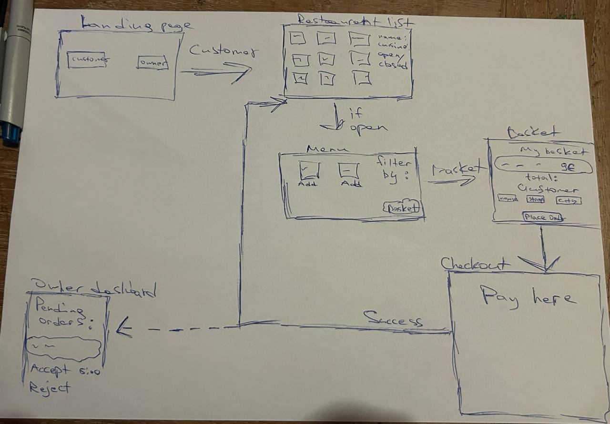

# 🍽️ Keep Dishes Going 

A React-based restaurant management and ordering system frontend.  
This project was created as part of my coursework to practice **React**, **TypeScript**, and **Material UI (MUI)** while connecting to a backend API.

---

## Tech Stack

**Frontend Framework:**
-  React (with Vite for fast development)

**Language & Tools:**
- TypeScript
- Material UI (MUI) — for styling and layout
-  React Router — for page navigation
-  React Query — for data fetching and caching
-  Context API — for managing authentication (SecurityContext)
-  Custom Basket Context — for cart management
-  Axios — for backend API communication

---

##  How to Run Locally

1. **Clone the repository**
   ```bash
   git clone https://gitlab.com/kdg-ti/programming6/students/25-26/chyhohidze-rufina/frontend.git
   cd <project-folder>

## Wireframes



## Challenges & Accomplishments

## Challenges
- The most significant challenge in this project was timing.
- Spending a lot of time for getting know new architecture design
- Spending time to wait posted slides for a certain topic such as security.
- A lot of refactoring, because new topics were discussed every week.
- No information about implementation of external payment system, complete self study on this topic
- Broad amount of requirements in order to complete the project
## Accomplishments 
- Implemented bigger part of use cases 
- Got to know how to integrate external payment system to the application
- Integrated RabbitMQ 
- Got familiar with React 
- Got to know how to connect backend to frontend fully
- Studied implementation of security
- Got familiar with hexagonal architecture
- and many many more
---

##  Finished Features

Features that were successfully implemented and tested.

- [x] As an owner, I want to sign up/sign in to access my restaurant management area.
- [x] As an owner, I want to create my restaurant by submitting name, full address, contact email, picture(s) url, default preparation time, type of cuisine, and opening hours.
- [x] As an owner, I want to edit a dish as a draft without affecting the live menu.
- [x] As an owner, I want to publish a dish so it becomes available to customers.
- [x] As an owner, I want to unpublish a dish so it is no longer available to customers.
- [x] As an owner, I want to mark a dish out of stock or back in stock immediately.
- [x] As an owner, I want to set opening hours and manually open/close the restaurant at any moment.
- [x] As an owner, I want to accept or reject new orders (and provide a reason on rejection for development).
- [x] As an owner, I want orders without a decision within five minutes to be automatically declined.
- [x] As a customer, I want the landing page to let me continue as a customer.
- [x] As a customer, I want to explore restaurants in a list or on a map.
- [x] As a customer, I want to view a restaurant’s details and dishes.
- [x] As a customer, I want to filter restaurants by type of cuisine, price range, distance, and guesstimated delivery time.
- [x] As a customer, I want to filter dishes by type (e.g., starter or dessert) and by food tags (lactose, gluten, vegan, …).
- [x] As a customer, I want sensible sorting options (e.g., price) when viewing dishes.
- [x] As a customer, I want to build a basket from a single restaurant’s published dishes.
- [x] As a customer, I want to provide my name, delivery address, and contact email at checkout.
- [x] As a customer, I want to pay using the payment provider during checkout.
- [x] As KDG, I want no more than 10 dishes to be available to customers at any moment.
- [x] As KDG, I want to publish messages for the delivery service when an order is accepted and when it is ready for pickup.
- [x] As KDG, I want to consume delivery service messages for picked up, delivered, and courier locations to update orders.
- [x] As KDG, I want customers to be able to order without signing up or signing in.
- [x] As KDG, I want each owner to manage exactly one restaurant.
---

##  Unfinished / Planned Features

Features that are planned and are in progress
- [ ] As an owner, I want to apply all pending dish changes in one action.
- [ ] As an owner, I want to schedule a set of publishes/unpublishes to go live together at a chosen time.
- [ ] As an owner, I want to provide a reason on rejection.
- [ ] As an owner, I want to mark an accepted order ready for pickup.
- [ ] As a customer, I want to see a guesstimated delivery time based on location, default preparation time, and busyness.
- [ ] As a customer, I want checkout to be blocked if any dish in my basket becomes out of stock or unpublished while I’m browsing.
- [ ] As a customer, I want a confirmation with a link so I can return to track my order.
- [ ] As a customer, I want to track the progress of my order as its status changes.
- [ ] As KDG, I want to be able to see the price range evolution of a restaurant
- [ ] As KDG, I want to adjust the price ranges criteria


 


